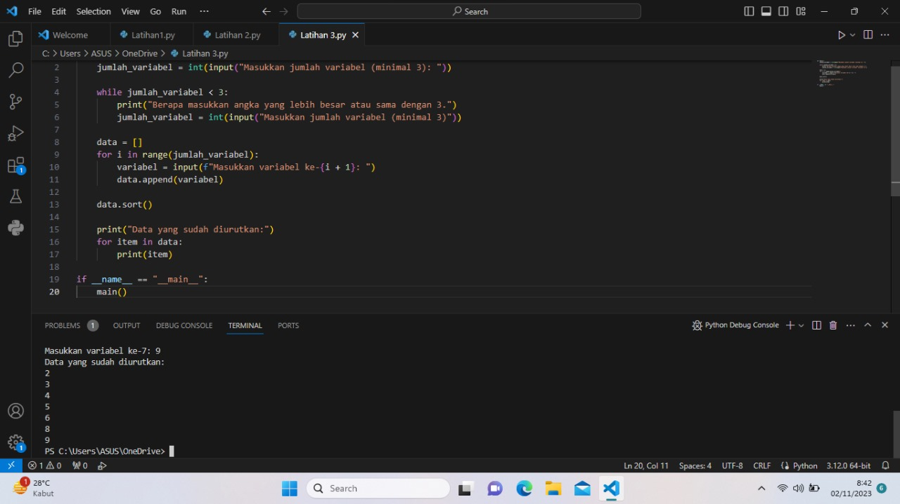

LANGKAH-LANGKAH STRUKTUR KONDISI

1. if adalah sturktur kondisi ia mengeksekusi blok yang ada di bawahnya hanya jika kondisi yang diberikan bernilai true.

2. Elif Singkatan dari"else if".ini digunakan untuk mengecek kondisi lain jika kondisi dalam if sebelumnya bernilai False.

3. Else Blok kode dibawah else akan dijalankan jika semua kondisi dalam if dan elif sebelumnya bernilai False

LANGKAH-LANGKAH PERULANGAN

1. Perulangan dengan "for"

2. Perulangan dengan while

3. Kontrol Perulangan

# STRUKTUR KONDISI LATIHAN 1

# STRUKTUR KONDISI LATIHAN 2

# PERULANGAN LATIHAN 1

# PERULANGAN LATIHAN 2

# FLOWCHART

